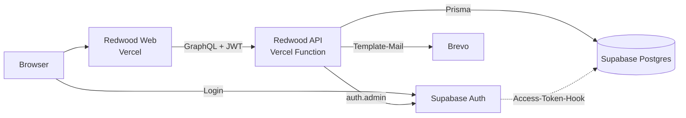
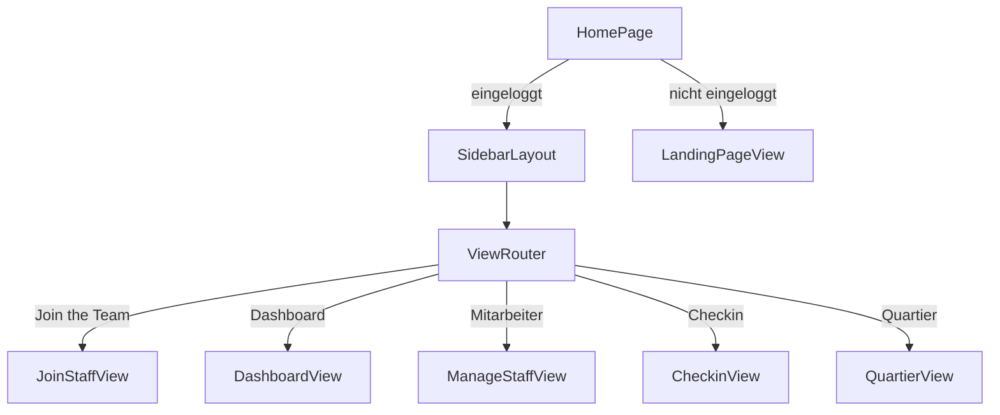
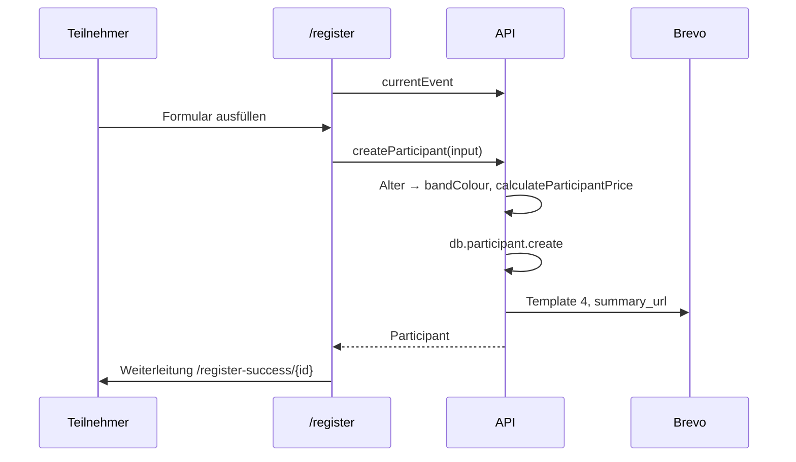

# Architektur

RedwoodJS 8.9 Monorepo mit den Yarn-Workspaces `api` (GraphQL-Backend) und `web` (React-Frontend, SSR aktiviert).

## Überblick



## API (`api/src`)

Jede Domäne folgt dem Redwood-Muster:

```
graphql/<name>.sdl.ts           Typen, Queries, Mutations, @requireAuth/@skipAuth
services/<name>/<name>.ts       Resolver (Geschäftslogik)
services/<name>/<name>.scenarios.ts  Testdaten
services/<name>/<name>.test.ts  Tests
```

| Service | Aufgabe |
| --- | --- |
| `events` | Events lesen, `currentEvent` für das Anmeldeformular |
| `participants` | Anmeldung inkl. Preis und Armbandfarbe, Bearbeitung, Check-in |
| `presences` | Anwesenheit der Mitarbeiter |
| `staff` | Mitarbeiterliste aus Supabase Auth + Rollen vergeben (nur admin) |
| `mailer` | Bestätigungsmail über Brevo |

Hilfsmodule in `lib/`:

- `db.ts`: Prisma-Client
- `auth.ts`: `getCurrentUser`, `requireAuth`, `hasRole`, siehe [Auth und Rollen](auth-und-rollen.md)
- `supabase.ts`: Supabase-Admin-Client mit Service-Key
- `brevoMailer.ts`: `sendRawBrevoEmail`, `sendTemplateBrevoEmail`
- `bigIntPolyfill.ts`: macht `BigInt` (IDs von Event und Presence) JSON-serialisierbar
- `utils.ts`: `getAge`

## Web (`web/src`)

### Routen

| Pfad | Seite | Zugang |
| --- | --- | --- |
| `/` | `HomePage` | öffentlich: Landingpage; eingeloggt: Mitarbeiter-App |
| `/login`, `/signup` | Login / Registrierung Mitarbeiter | öffentlich |
| `/verify` | Bestätigung nach Signup | öffentlich |
| `/register` | Anmeldeformular Teilnehmer | öffentlich |
| `/register-success/{id}` | Zusammenfassung der Anmeldung | öffentlich (Link aus Mail) |

### Mitarbeiter-App: eine Seite, mehrere Views

Die eingeloggte App hat **keine eigenen Routen**. `HomePage` rendert für eingeloggte User `SidebarLayout` + `ViewRouter`:



- Die gewählte View steht im Sidebar-Context und in `localStorage` (`activeSidebarItem`).
- Welche Views ein User sieht, bestimmt `getSidebarItemsByRole` anhand von `currentUser.roles`.

**Neue View hinzufügen:**
1. Komponente in `web/src/pages/HomePage/views/<Name>View/` anlegen
2. Namen zum Typ `SidebarItem` hinzufügen (`SidebarLayout.tsx`)
3. In `viewMap` in `views/ViewRouter.tsx` eintragen
4. In `getSidebarItemsByRole` für die passenden Rollen freischalten (mit Icon)

### UI

- Tailwind + shadcn/ui (`components/ui`), Animationen aus `components/animate-ui`
- Tabellen: `components/ui/data-table` + `hooks/use-data-table.ts`
- Alerts: `hooks/AlertHook.tsx` (`useAlert`)
- Datenabfragen über Redwood Cells (`*Cell`-Komponenten)

## Abläufe

### Anmeldung eines Teilnehmers



### Check-in

1. Mitarbeiter mit Rolle `checkin` (oder `admin`) öffnet die View **Checkin**.
2. `CheckinOverview` listet die Teilnehmer (`ParticipantsTableCell`), `CheckinDetails` lädt einen Teilnehmer und zeigt ihn in `ParticipantDetailForm` inkl. Armbandfarbe.
3. Beim Bestätigen speichert `ParticipantDetailForm` die (ggf. korrigierten) Daten mit `checkinConfirmed: true` über die Mutation `updateParticipant`.

> `checkinParticipant` ist im SDL definiert, hat aber keinen Resolver im Service und wird vom Frontend nicht verwendet.
