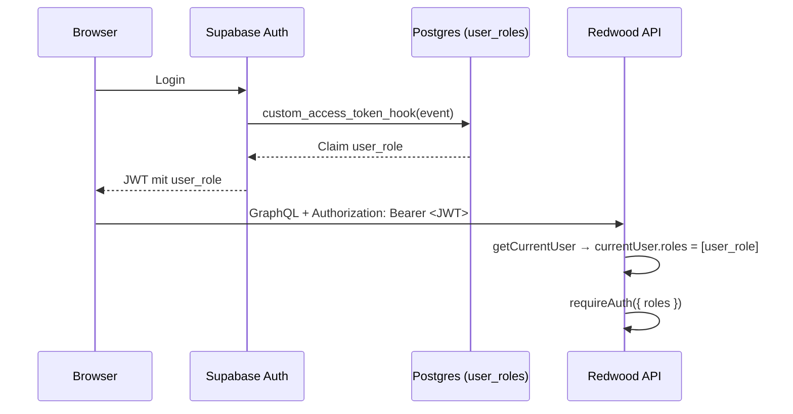

# Auth und Rollen

## Login

- Login und Registrierung von Mitarbeitern laufen über **Supabase Auth** (`web/src/auth.ts`, `@redwoodjs/auth-supabase-web`).
- Nach dem Signup bekommt man eine Bestätigungsmail; der Link führt auf `/verify` (`VerifySignupPage`).
- Teilnehmer brauchen **keinen** Account. Die Anmeldung über `/register` ist öffentlich.

## Rollen

Rollen stehen in der Tabelle `public.user_roles` (Prisma-Model `UserRole`). Jeder User hat genau eine Rolle (`userId` ist unique).

| Rolle | Sidebar-Views | Erlaubte Aktionen im Backend |
| --- | --- | --- |
| `admin` | Join the Team, Dashboard, Mitarbeiter, Checkin | alles, inkl. `staffUsers` / `updateStaffRole` |
| `checkin` | Join the Team, Checkin | alle Operationen mit `@requireAuth` |
| `quartier_boys`, `quartier_girls` | Join the Team | alle Operationen mit `@requireAuth` |
| `none` (Standard) | Join the Team | alle Operationen mit `@requireAuth` |

Die Sichtbarkeit der Views steuert `getSidebarItemsByRole` in `web/src/layouts/SidebarLayout/SidebarLayout.tsx`. Sie ist **nur** UI. Die eigentliche Absicherung passiert im Service mit `requireAuth({ roles: [...] })`.

> **Bekannte Lücken**
> - Nur der `staff`-Service prüft Rollen. Teilnehmer- und Presence-Operationen verlangen nur einen Login, also kann auch ein User mit Rolle `none` Teilnehmer lesen, ändern und löschen.
> - Die Sidebar prüft auf `'quartier'`, das Enum kennt aber nur `quartier_boys` / `quartier_girls`. Die Quartier-View wird deshalb nie angezeigt.

## Wie die Rolle ins Backend kommt

1. **`custom_access_token_hook`** (Postgres-Funktion, Migration `20260502070949_add_role_handling`) liest die Rolle aus `user_roles` und schreibt sie als Claim `user_role` ins JWT.
2. **`getCurrentUser`** (`api/src/lib/auth.ts`) macht daraus `currentUser.roles`.
3. **`requireAuth`** im Service bzw. die Direktive `@requireAuth` im SDL prüft Login und Rolle.

Die Rolle steht im Token. Nach einer Rollenänderung gilt die neue Rolle erst, wenn das Token erneuert wird: **neu einloggen** oder bis zum automatischen Refresh warten.

## Neue User

Der Trigger `on_auth_user_created` ruft `handle_new_user` auf und legt für jeden neuen User einen Eintrag mit Rolle `none` an. Weil Prisma keinen Zugriff auf das Schema `auth` hat, müssen Hook und Trigger einmalig pro Supabase-Projekt von Hand aktiviert werden, siehe [Betrieb → Supabase einrichten](betrieb.md#supabase-einrichten).

## Rollen vergeben

- Ein Admin vergibt Rollen in der View **Mitarbeiter** (`ManageStaffView`, Mutation `updateStaffRole`). Der eigene Account wird dort nicht angezeigt.
- Der **erste Admin** muss per SQL gesetzt werden, siehe [Betrieb](betrieb.md#ersten-admin-anlegen).

## Öffentliche Endpunkte (`@skipAuth`)

| Operation | Grund |
| --- | --- |
| `events`, `event`, `currentEvent` | Anmeldeformular braucht Eventdaten |
| `createParticipant` | Anmeldung ohne Account |
| `participant(id)` | Erfolgsseite `/register-success/{id}` und Link in der Bestätigungsmail |

`participant(id)` gibt die vollständigen Daten des Teilnehmers an jeden heraus, der die UUID kennt. Die UUID ist praktisch nicht zu erraten, steht aber im Mail-Link.
