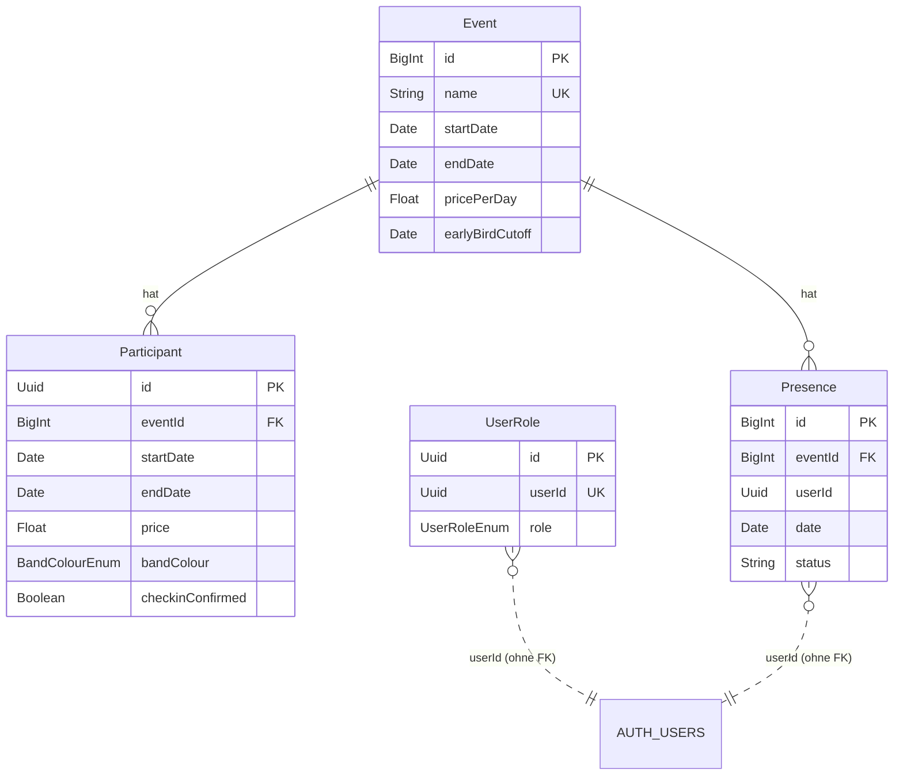

# Datenbank

Postgres bei Supabase, angesprochen über Prisma (`api/db/schema.prisma`, Client in `api/src/lib/db.ts`).

## Datenmodell



`AUTH_USERS` ist Supabases `auth.users`. Prisma hat darauf keinen Zugriff, deshalb gibt es keine Fremdschlüssel auf diese Tabelle.

### Felder, die nicht selbsterklärend sind

| Feld | Bedeutung |
| --- | --- |
| `Participant.startDate` / `endDate` | Tatsächlicher An- und Abreisetag des Teilnehmers (Teilnahme an einzelnen Tagen möglich) |
| `Participant.price` | Wird bei der Anmeldung berechnet und gespeichert, siehe unten |
| `Participant.bandColour` | Farbe des Armbands, wird beim Check-in ausgegeben |
| `Participant.participationRole` | TODO: Bedeutung und mögliche Werte |
| `Participant.checkinConfirmed` | `true`, sobald der Teilnehmer vor Ort eingecheckt ist |
| `Event.earlyBirdCutoff` | Bis zu diesem Tag (inklusive) gibt es Frühbucherrabatt |
| `Presence` | Anwesenheit von Mitarbeitern pro Tag. TODO: mögliche Werte von `status` |

### Armbandfarben

| Wert | Gruppe | Vergabe |
| --- | --- | --- |
| `red_mitarbeiter` | Mitarbeiter | manuell |
| `white_team` | Team | manuell |
| `yellow_tagesgaeste` | Tagesgäste | manuell |
| `blue_ue18` | 18 Jahre und älter | automatisch |
| `dark_green_ue16` | 16–17 Jahre | automatisch |
| `lime_ue14` | unter 16 Jahre | automatisch |

Das Alter wird zum **Startdatum des Events** berechnet (`createParticipant` in `api/src/services/participants/participants.ts`).

## Preisberechnung

`calculateParticipantPrice` in `api/src/services/participants/participants.ts`:

```
Tage  = (endDate − startDate) + 1        // An- und Abreisetag zählen beide
Preis = Tage × event.pricePerDay
Preis = Preis × 0,9   wenn Anmeldedatum ≤ event.earlyBirdCutoff
```

- Ohne `pricePerDay` ist der Preis `0`.
- Gerundet auf 2 Nachkommastellen.
- Der Preis wird nur beim Anlegen berechnet. Spätere Änderungen an Event oder Aufenthaltsdauer passen ihn **nicht** an.

## Migrationen

```bash
# Schema ändern, dann:
yarn format-db                  # formatieren und validieren
yarn rw prisma migrate dev      # Migration erstellen und lokal anwenden
yarn rw g types                 # Typen neu generieren

# Produktion
yarn migrate:prod
```

- Jede Schemaänderung kommt **mit Migration** in den PR (Checkliste im PR-Template).
- `yarn rw prisma db push` nur für schnelles lokales Ausprobieren, nie auf Staging/Produktion.
- Migrationen dürfen eigenes SQL enthalten, z. B. Funktionen. Objekte im Schema `auth` (Trigger, Hooks) können nicht per Migration angelegt werden, siehe [Betrieb](betrieb.md#supabase-einrichten).

### Verbindungen

- `SUPABASE_TRANSACTION_POOLER_URL` (`url`): Laufzeit, über PgBouncer im Transaction-Modus.
- `SUPABASE_SESSION_POOLER_URL` (`directUrl`): Migrationen und Introspection.

## Seed

`scripts/seed.ts` legt ein Beispiel-Event an:

```bash
yarn seed
```
